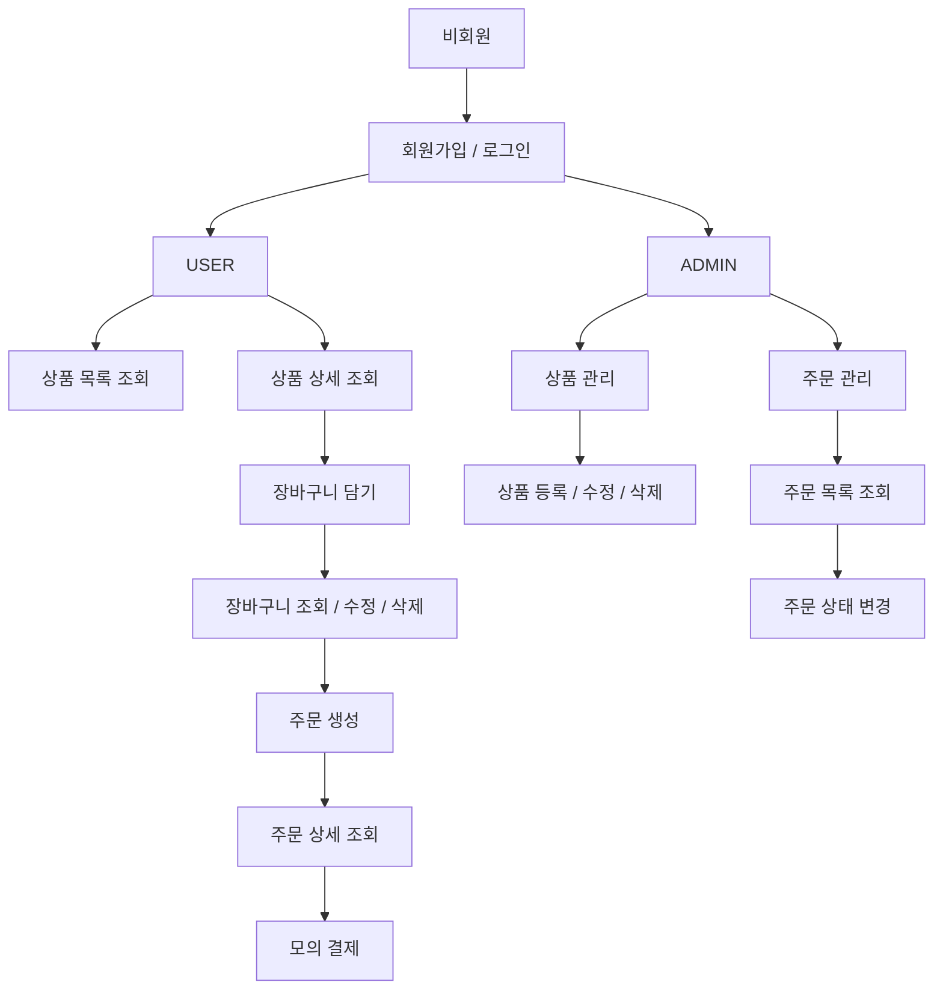

# 💄 Lumiera

루미에라는 화장품 브랜드의 자사 온라인 스토어를 가정하고 개발한 **브랜드몰 이커머스 플랫폼 개인 프로젝트**입니다.  
Spring Security 기반 인증/인가를 적용해 일반 사용자(`USER`)와 관리자(`ADMIN`) 권한을 분리하고,  
상품 조회, 장바구니, 주문, 관리자 상품/주문 관리 기능을 **Spring MVC + Spring Boot + MyBatis + JSP** 구조로 구현했습니다.

---

## 🪞 프로젝트 소개

루미에라는 아래와 같은 흐름을 중심으로 설계했습니다.

- Spring Security 기반 로그인 인증 및 권한 제어
- 사용자 / 관리자 기능 분리
- 상품 목록 조회, 상세 조회, 검색, 페이징
- 장바구니 담기 / 수량 변경 / 삭제
- 주문 생성 / 주문 상세 조회 / 모의 결제
- 관리자 상품 등록 / 수정 / 삭제
- 관리자 주문 조회 / 상태 변경
- 이미지 업로드 및 상세 이미지 관리

---

## 💻 기술 스택

**Backend**  
Java 17, Spring Boot, Spring MVC, Spring Security, MyBatis

**View Template**  
JSP, JSTL

**Database**  
MySQL

**Infra / Tools**  
Gradle, Git / GitHub, IntelliJ IDEA

---

## 🔄 플로우차트

사용자와 관리자 권한을 기준으로 주요 기능 흐름을 정리했습니다.



---

## 🧩 ERD


---

## 🗂️ 프로젝트 구조
```
src/main/java/com/lumiera/shop/lumierashop
├── controller
├── domain
│   └── enums
├── dto
│   ├── request
│   └── response
├── global
│   ├── annotation
│   ├── common
│   │   └── pagination
│   ├── error
│   │   ├── code
│   │   └── exception
│   └── security
├── mapper
└── service
```

---

## ✨ 주요 기능
### 👤 인증 / 회원 관리

- 회원가입 및 로그인 기능 구현
- 로그인/로그아웃은 Spring Security 세션 기반으로 처리
- 아이디/비밀번호 유효성 검증 적용
- 아이디 중복 확인 및 비밀번호 확인 검증 적용

### 🛍️ 상품 조회

- 전체 사용자는 상품 목록과 상세 정보를 조회 가능
- 사용자 화면에서는 삭제되지 않은 상품만 조회 가능
- 상품 목록 조회 시 키워드 검색, 카테고리 필터링, 페이징 지원

### 🛒 장바구니

- 로그인한 사용자는 상품을 장바구니에 추가 가능
- 동일 상품 재추가 시 수량이 누적되도록 처리
- 장바구니에서 상품 수량 변경 및 제거 가능
- 장바구니 추가/수정 시 재고 수량 초과 여부 검증

### 📦 주문

- 로그인한 사용자는 장바구니에서 선택한 상품으로 주문 생성 가능
- 주문 목록 조회 및 주문 상세 조회 가능
- 장바구니 상품 정보를 기반으로 총 주문 금액 계산
- 주문 상태가 PENDING일 때 모의 결제 가능

### 🛠️ 관리자 상품 관리

- 관리자는 상품 등록, 수정, 삭제 가능
- 관리자 화면에서는 삭제된 상품을 포함한 모든 상품 조회 가능
- 상품 등록 시 대표 이미지와 상세 이미지를 함께 저장
- 상품 수정 시 대표 이미지 변경 및 상세 이미지 교체 가능
- 상품 삭제는 Soft Delete 방식 적용

### 📋 관리자 주문 관리

- 관리자는 주문 목록 및 주문 상세 조회 가능
- 주문 기간, 상태, 주문자 기준 검색 지원
- 주문 상태를 일괄로 PENDING → PREPARING 상태로 변경 가능

---

## 🔐 권한 정책
- **USER** : 로그인한 일반 사용자
- **ADMIN** : 관리자 권한 사용자

Spring Security 설정과 `@PreAuthorize`, `sec:authorize` 태그를 사용해 역할별 접근 제어를 적용했습니다.

USER 중심 기능 : `/products`, `/cart`, `/orders`    
ADMIN 전용 기능 : `/admin/products`, `/admin/orders`

---

## 🚀 핵심 구현 포인트

### 1. Spring Security 기반 인증 / 권한 분리

Spring Security를 활용해 로그인/로그아웃을 처리하고, 관리자와 사용자의 기능을 URL 단위로 분리했습니다.
또한 JSP에서 `sec:authorize` 태그를 사용해 권한별 메뉴와 기능이 다르게 노출되도록 구성했습니다.

### 2. DTO 기반 입력 검증 및 서버 사이드 에러 처리

회원가입, 상품 등록/수정, 장바구니 수량 변경 등 사용자 입력이 필요한 기능은 요청 DTO로 분리하고,
`@Valid`, `BindingResult`, `Bean Validation`을 적용해 서버 측 검증을 수행했습니다.
검증 실패 시에는 같은 화면으로 다시 반환하고, JSP `form:errors`를 통해 필드 단위 오류 메시지를 출력했습니다.

### 3. 검색 / 페이징 및 MyBatis 동적 SQL 구현

상품 목록과 주문 목록에서 검색 기능과 페이지네이션을 구현했습니다.
검색 조건 DTO와 `PaginationService`, `PageHandler`를 사용해 조회 범위를 계산했고,
MyBatis `<if>`, `<choose>`, `<where>`를 활용해 키워드, 카테고리, 상태, 삭제 여부 등의 조건을 동적으로 조합했습니다.

---

## 🛠️ 트러블슈팅

### 1. MyBatis 파라미터 바인딩 이름 불일치 문제

주문/상품 검색 기능 구현 중, 검색 조건이 전달되었음에도 조회 결과가 예상과 다르게 반환되는 문제가 있었습니다.  
원인은 MyBatis 동적 SQL에서 사용한 조건명과 실제 파라미터명이 일치하지 않아 조건절이 정상 적용되지 않았기 때문이었습니다.  
동적 SQL의 `test` 조건과 바인딩 파라미터명을 동일하게 맞춰 해결했습니다.  
이 경험을 통해 동적 SQL 조건명과 파라미터명은 일관되게 관리해야 한다는 점을 다시 확인할 수 있었습니다.

### 2. MyBatis resultMap 매핑으로 조회 결과가 1건만 반환되던 문제

상품 목록 조회 시 SQL상으로는 여러 건이 조회되었지만, 실제 응답에서는 1건만 반환되는 문제가 있었습니다.  
원인은 `resultMap`에서 `<id>`를 지정하지 않아 MyBatis가 각 행을 구분하지 못하고 하나의 객체로 병합했기 때문이었습니다.  
처음에는 식별용 필드를 DTO에 추가하는 방법도 검토했지만, 응답 객체에 불필요한 필드를 추가하고 싶지 않아 조회 목적에 맞게 DTO 구조를 단순화하고 필요한 값만 명확히 매핑하도록 수정해 해결했습니다.  
이 경험을 통해 `resultMap`의 `<id>`가 결과를 식별하고 중복 병합을 방지하는 기준으로 동작한다는 점을 알게 되었습니다.

### 3. JSP form 바인딩 적용 시 모델 참조 기준과 모델명 불일치 문제

JSP 폼 화면 구현 과정에서 `form:form` 태그 바인딩과 모델 참조 방식 때문에 두 가지 문제를 겪었습니다.

첫 번째는 `form:form` 사용 시 `modelAttribute`를 기준 객체로 두고 내부 `path`는 필드명만 작성해야 하는데, 일반 EL 표현식처럼 모델명까지 포함해 접근 기준을 혼동하면서 화면 렌더링이 정상적으로 되지 않았던 점입니다.  
원인은 `form:form`의 바인딩 기준을 정확히 이해하지 못한 것이었고, `modelAttribute`를 기준으로 `path`를 필드명만 작성하도록 수정해 해결했습니다.

두 번째는 JSP에서 참조하는 모델명과 실제 컨트롤러에서 전달한 모델 어트리뷰트 이름이 일치하지 않아 바인딩 오류가 발생한 점입니다.  
원인은 `@ModelAttribute` 이름을 명시하지 않아 Spring이 클래스명 기반 기본 모델명을 사용했는데, JSP에서는 이를 파라미터명 기준의 다른 이름으로 참조하고 있었기 때문이었습니다.  
`@ModelAttribute` 이름과 JSP의 참조 이름을 일치시키도록 수정해 해결했습니다.

### 4. 리다이렉트 시 Model 값 유실 문제

장바구니 추가 과정에서 수량 검증에 실패한 뒤 상품 상세 페이지로 리다이렉트할 때, 검증 결과가 함께 전달되지 않는 문제가 있었습니다.  
원인은 `Model`이 요청 범위에서만 유효해 리다이렉트 상황에서는 값이 유지되지 않았기 때문이었습니다.  
이를 `RedirectAttributes`의 `addFlashAttribute()`로 변경해 검증 결과가 정상적으로 전달되도록 해결했으며,  
이 경험을 통해 포워드와 리다이렉트는 데이터 전달 방식이 다르기 때문에, 상황에 맞는 객체를 구분해 사용해야 한다는 점을 알게 되었습니다.

### 5. `INNER JOIN`으로 조회 결과가 누락되던 문제

주문 조회 기능에서 실제 주문 데이터가 존재함에도 404가 반환되는 문제가 있었습니다.  
원인은 주문 정보는 저장되어 있었지만 연관된 주문 아이템이 누락된 데이터가 있었고, 기존 조회 쿼리가 `INNER JOIN` 기반이어서 결과가 사라지고 있었기 때문이었습니다.  
삭제된 상품 등으로 연관 데이터가 없는 경우도 조회할 수 있도록 `LEFT JOIN`으로 변경해 해결했습니다.  
이 과정을 통해 조회 쿼리 작성 시 정상 데이터만 가정하지 않고, 연관 데이터가 일부 누락된 경우까지 함께 고려해야 한다는 점을 정리할 수 있었습니다.

### 6. Spring Security 설정 순서로 인해 권한 없는 사용자가 화면에 접근 가능했던 문제

관리자 전용 화면에 일반 사용자가 접근 가능한 문제가 있었습니다.  
원인은 `SecurityFilterChain`의 `requestMatchers`가 선언 순서대로 적용되는데, 더 넓은 범위의 패턴이 앞에 위치해 권한 제한이 제대로 동작하지 않았기 때문이었습니다.  
권한이 더 구체적인 URL 패턴을 상단에 배치하도록 순서를 재정리해 접근 제어가 의도한 대로 동작하도록 수정했습니다.  
이 경험을 통해 보안 설정에서는 선언 내용뿐 아니라 적용 순서도 함께 점검해야 한다는 점을 알게 되었습니다.

### 7. 상품 수정 시 빈 파일 리스트가 전달되어 이미지 변경 로직이 오동작한 문제

상품 수정 기능에서 이미지를 업로드하지 않았는데도 상세 이미지 변경 로직이 실행되는 문제가 있었습니다.
원인은 `List<MultipartFile>`이 완전히 비어 있지 않고, 브라우저 기본값에 의해 빈 MultipartFile 객체가 포함된 상태로 전달되었기 때문이었습니다.
단순 null 체크나 `isEmpty()`만으로는 실제 업로드 여부를 구분하기 어려워, stream 전처리를 통해 실제 파일 내용이 있는 경우에만 변경 로직을 타도록 수정했습니다.  
이 과정을 통해 파일 업로드 처리에서는 컬렉션 자체의 비어 있음보다 각 파일의 실제 내용 유무를 함께 확인해야 한다는 점을 알게 되었습니다.

---

## 📝 회고

### 공용 JSP와 컨트롤러 책임 분리를 다시 설계한 경험

초기에는 공용 JSP를 사용하면 컨트롤러도 하나로 통합해야 한다고 판단해 권한별 로직을 하나의 컨트롤러에 함께 작성했습니다.
그 결과 중복 메서드가 늘어나고 책임이 모호해져 유지보수성이 떨어졌습니다.  
이후 공용 JSP는 유지하되 컨트롤러와 로직은 역할에 따라 분리하고, JSP에서는 권한에 따라 URL만 분기하도록 구조를 개선했습니다.  
이 경험을 통해 같은 화면을 사용하더라도 URL과 컨트롤러는 역할에 따라 분리할 수 있으며, 화면 재사용과 책임 분리는 별개의 문제라는 점을 배웠습니다.

### MVC 기반 화면 흐름을 직접 구현하며 배운 점

기존에는 JSON 응답 중심 개발에 더 익숙해, `Model`을 통해 데이터를 전달하고 JSP를 렌더링하는 MVC 흐름이 처음에는 다소 낯설었습니다.  
프로젝트를 진행하면서 모델 바인딩, `form:form` 태그 처리, 리다이렉트와 포워드의 차이 등을 하나씩 적용해보며 화면 중심 구조를 조금씩 이해할 수 있었습니다.  
완전히 익숙하다고 말하기는 어렵지만, 이번 프로젝트를 통해 기존에 익숙했던 방식과 다른 구조를 직접 구현하며 배워볼 수 있었다는 점이 의미 있었습니다.
