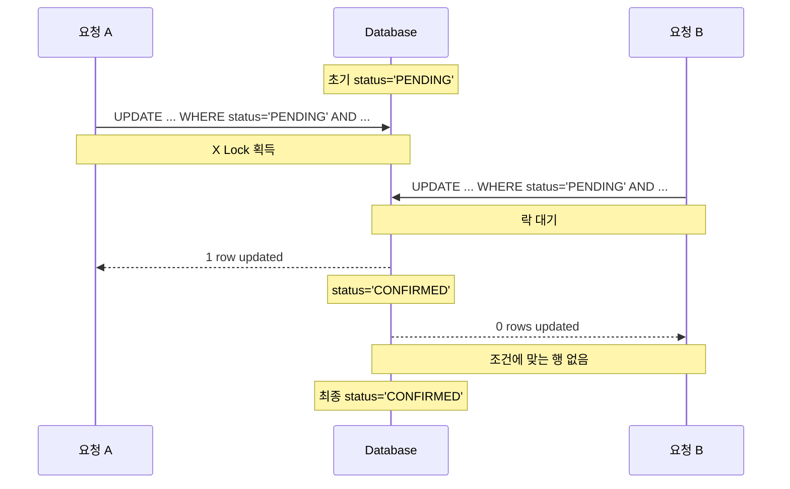

## 조건부 UPDATE를 활용한 주문 중복 처리 방지

### 문제
동일한 주문에 여러 요청이 동시에 들어올 경우 주문이 중복 처리될 가능성이 있었습니다.  
주문은 한 번만 정상 처리되어야 하므로, 동시 요청 상황에서도 중복 결제와 중복 재고 차감을 방지할 수 있는 제어가 필요했습니다.

### 해결
주문 상태가 `PENDING`인 경우에만 처리되도록 조건부 UPDATE를 적용해, 먼저 성공한 요청만 주문 상태를 변경하도록 구현했습니다. 또한 재고 차감과 주문 확정 로직을 하나의 트랜잭션으로 묶어 중간에 실패하면 함께 롤백 되도록 처리했습니다.

### 결과
동일 주문 1건에 대해 50개의 동시 요청을 보낸 결과, 1건만 성공하고 나머지 요청은 `PENDING` 조건을 만족하지 못해 실패했습니다.  
이를 통해 중복 결제 및 중복 재고 차감 방지 로직이 의도대로 동작함을 확인했습니다.
